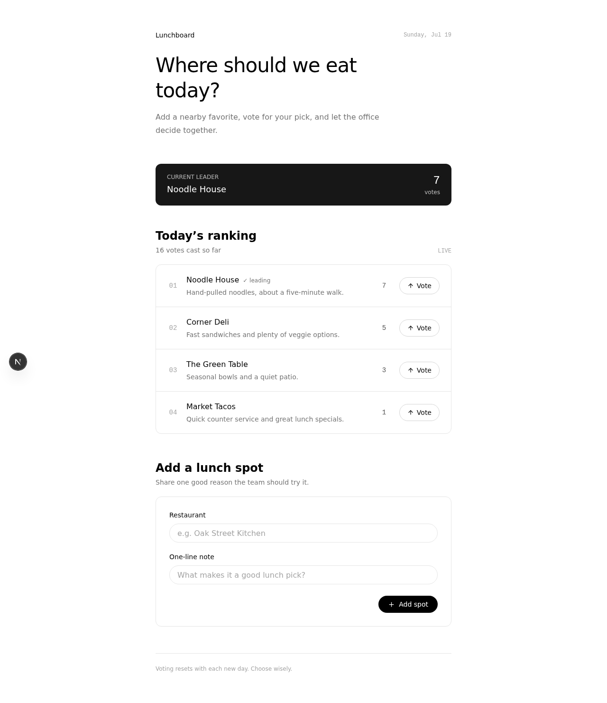

# DiscordBuilder — multiplayer vibe coding

**Your Discord server becomes a development studio.** A community member asks
for a tool in plain language with `/build`. OpenAI Codex, running GPT-5.6 Sol,
builds a full-stack app in an isolated Docker container and posts the working
result back to a Discord thread. Replies become edits, existing data stays in
place, and a community 👍 vote approves the release.

> 🎬 **Demo video:** _public YouTube link will be added before submission_

<p align="center">
  
  <br/>
  <em>A real app generated from one Discord message — Next.js + SQLite, running behind a public URL.</em>
</p>

## The problem

Every community needs small, specific tools: a festival shift scheduler, an
RSVP page, a book-club vote. They usually never get built. The people who feel
the need may not code, while the people who code may not have the time or the
full context.

DiscordBuilder moves software creation into the place where the community
already talks. The conversation becomes the specification, development
history, edit interface, and release record.

## The three-minute experience

1. A member runs `/build request: A food-stall shift scheduler for our school festival.`
2. The bot creates a thread and continuously edits one progress message with
   Codex's commands, file changes, and status.
3. Codex returns screenshots, a plain-language change summary, and an **Open
   the app** button.
4. A member opens the generated app on their phone and adds real data to its
   SQLite database.
5. Someone replies in the thread: `Prevent double-booking and grey out full slots.`
6. Codex edits the same project. The new rule appears and the existing signup
   data remains.
7. Enough distinct people react 👍. The bot closes the vote, marks the thread
   approved, and announces the app in the parent channel.

The complete demo script and reset runbook are in [`docs/demo`](docs/demo).

## Why Codex is the product, not a thin API call

The runtime app builder is **OpenAI Codex** in non-interactive mode:
`codex exec --json --ephemeral -m gpt-5.6-sol`. DiscordBuilder turns that agent
into a reliable community-facing workflow.

- **Bounded authority.** Every project has its own Docker container and working
  copy. Codex may edit `app/**`, `db/schema.ts`, and `db/seed.ts`; auth, database
  initialization, dependencies, and framework configuration remain
  human-owned. The boundary is defined in
  [`templates/app-template/AGENTS.md`](templates/app-template/AGENTS.md), which
  Codex reads for every build.
- **A full-stack starting point.** The single template contains Next.js 15
  App Router, React 19, Tailwind CSS v4, Drizzle ORM, and SQLite. Reads and
  writes stay behind Server Actions or Route Handlers, and input is validated
  before it reaches the database.
- **A design contract.** [`DESIGN.md`](templates/app-template/DESIGN.md) defines
  a monochrome, mobile-first visual system with pre-wired tokens. Generated
  apps share a coherent product language instead of inheriting arbitrary AI
  styling.
- **A self-checking quality loop.** Codex applies the schema, seeds realistic
  sample data on an initial build, runs strict typechecking and a production
  build, starts the app, captures every key route at 1280px and 390px, and
  inspects both desktop and mobile output. It gets at most three iterations and
  must report partial or failed work honestly.
- **A machine-readable handoff.** Codex writes `BUILD_RESULT.json` containing
  status, summary, changes, screenshots, notes, attempts, and a `dataReset`
  warning. The orchestrator validates every field before presenting the result
  to non-developers.
- **Live agent UX.** The Codex JSONL event stream becomes the build's live
  progress display. The raw stream is also retained under
  `var/projects/<project-id>/logs/`, making the agent's work an inspectable
  development record.

The exact Codex CLI surface was verified against `codex-cli 0.144.5`; see
[`packages/sandbox/README.md`](packages/sandbox/README.md) for the invocation
and authentication details.

## Architecture

```text
Discord (discord.js v14: slash command, threads, replies, reactions)
   │
   │  /build → live progress → screenshots + preview → edit replies → 👍 gate
   ▼
Orchestrator (Node.js + strict TypeScript)
   │  serial per-project queue; up to two projects build concurrently
   │  validates BUILD_RESULT.json and stores thread ↔ project bindings
   ▼
Per-project Docker sandbox
   │  app template + Codex CLI + generated app + persistent SQLite data
   │  codex exec --json → typecheck/build/screenshot quality loop
   ▼
Deploy target
      local: localhost:<port>
      cloudflared: temporary public HTTPS quick tunnel
```

An edit is queued behind earlier work on the same project, while unrelated
projects can build in parallel. The container and project directory survive
successful edits, which is how the generated app and its SQLite data remain
available between requests.

## Fastest way to test: CLI only

This exercises the same template, Docker sandbox, Codex invocation, structured
event stream, quality loop, and preview server as the Discord flow. No Discord
application is required.

### Prerequisites

- macOS with Docker Desktop (the environment used for end-to-end verification)
- Node.js 22 or newer
- pnpm 9 (`corepack enable` is sufficient)
- OpenAI Codex CLI, using either `codex login` or the API-key mode documented
  below

```sh
git clone https://github.com/HarutoKimura/DiscordBuilder.git
cd DiscordBuilder
pnpm install
cp .env.example .env
docker build -t discordbuilder-sandbox \
  -f infra/docker/sandbox.Dockerfile infra/docker
pnpm cli build "An RSVP page for our next meetup, with a headcount"
```

The first run installs the template dependencies in the container and therefore
takes longer. When the build finishes, the CLI prints the generated project's
status, changes, screenshot paths, and a local URL such as
`http://localhost:4100`.

To send an edit to that same app, reuse the project ID printed by the first run:

```sh
pnpm cli build "Add a dietary-requirements field" --project app-abc123
```

## Run the complete Discord flow

In addition to the CLI prerequisites, create a Discord application and bot:

1. Enable the **Message Content** privileged gateway intent.
2. Install the bot in a test server with the `bot` and `applications.commands`
   scopes. It needs permission to view and send messages, create and use public
   threads, embed links, attach files, add reactions, and read message history.
3. Copy `.env.example` to `.env` and set `DISCORD_BOT_TOKEN` and
   `DISCORD_CLIENT_ID`.
4. For a phone-accessible demo, install `cloudflared`, then set
   `DEPLOY_MODE=cloudflared`. For host-only testing, keep the safer default,
   `DEPLOY_MODE=local`.

```sh
pnpm dev
```

The bot registers the guild-scoped `/build` command when it connects. Run it in
a normal server text channel:

```text
/build request: An RSVP page for our next meetup, with a headcount.
```

Any non-bot text reply in the generated thread becomes the next edit request.
After each successful or partial build with a usable URL, the bot opens a new
👍 approval vote. Only the latest build remains voteable.

## Configuration

| Variable | Default | Purpose |
|---|---|---|
| `DISCORD_BOT_TOKEN` | — | Required for the Discord bot. |
| `DISCORD_CLIENT_ID` | — | Discord application ID used to register `/build`. |
| `CODEX_MODEL` | `gpt-5.6-sol` | Model passed to `codex exec -m`. |
| `CODEX_AUTH_MODE` | `chatgpt` | `chatgpt` copies the host Codex login into each container; `api-key` authenticates with `OPENAI_API_KEY`. |
| `OPENAI_API_KEY` | — | Required only when `CODEX_AUTH_MODE=api-key`. |
| `DEPLOY_MODE` | `local` | `local` keeps previews on the host; `cloudflared` creates temporary public URLs. |
| `SHIP_APPROVAL_VOTES` | `2` | Distinct human 👍 votes required for approval. Use `1` for a solo rehearsal. |

`SANDBOX_MODE` currently supports only `local-docker`. `BASE_DOMAIN` is reserved
for the planned stable VPS deployment and is not used by the current local or
quick-tunnel targets.

### Choose a Codex authentication mode

For local development, the default reuses an existing Codex subscription login:

```dotenv
CODEX_AUTH_MODE=chatgpt
```

Run `codex login` on the host first. DiscordBuilder copies the host's
`~/.codex/auth.json` into each sandbox when it starts; it never bind-mounts the
credential file or commits it to a generated project.

For usage-based API billing, create an API key in the
[OpenAI Platform dashboard](https://platform.openai.com/api-keys), then set:

```dotenv
CODEX_AUTH_MODE=api-key
OPENAI_API_KEY=sk-...
```

No separate `codex login` is required in API-key mode. For each build,
DiscordBuilder passes the key over stdin and exposes it as `CODEX_API_KEY` only
to that single `codex exec` process. The key is not stored in Docker's container
configuration, command-line arguments, the generated app, or the container
filesystem. Keep it only in the gitignored `.env` file and never paste it into
a `/build` request.

API-key runs are charged to the OpenAI Platform account at standard API rates;
they do not use included ChatGPT plan credits. This follows the official
[Codex environment-variable guidance](https://learn.chatgpt.com/docs/config-file/environment-variables#authentication-and-network).

## Data preservation and trust boundaries

- On initial builds, Codex creates small idempotent seed data so the first
  screen is useful rather than empty.
- On edits, the agent contract forbids reseeding, dropping tables, truncating
  data, or deleting the SQLite file. Schema changes should be additive. If a
  request truly requires destructive migration, Codex must set `dataReset: true`
  and explain the loss; Discord displays a prominent warning.
- Agent-authored screenshot paths are treated as untrusted. Uploads are limited
  by count and size, constrained to the project root, opened with `O_NOFOLLOW`,
  and checked against the same inode before their bytes are sent to Discord.
- User text cannot trigger Discord mentions through bot responses.
- Interrupted initial builds are reclaimed, queued users are notified on
  shutdown, and public tunnel processes are terminated with the bot.

### Current prototype limitation

`DEPLOY_MODE=local` is private to the host and is the default. Cloudflare quick
tunnels are an explicit demo opt-in: their URLs are random and temporary, but
**they are not authenticated**. Anyone with the link can open the app while the
tunnel is running. A Discord-membership OAuth gate is the next security
milestone before production use.

## Verification

```sh
pnpm typecheck
pnpm test
```

The golden path has also been exercised end to end on a real Discord server:
initial build, streamed Codex progress, public phone access, persisted SQLite
data, multiple thread-driven edits, and reaction-gated approval.

Every non-draft PR to `main` is additionally reviewed by two split-context,
adversarial AI reviewers through the
[`adversarial-review` workflow](.github/workflows/adversarial-review.yml). They
see only the diff, assume the change is wrong, and must support each finding
with a concrete failure scenario. That process caught 38 confirmed issues
during development, including race conditions, resource leaks, and a screenshot
symlink-exfiltration path.

## Repository layout

```text
apps/bot                    Discord bot and orchestration workflow
apps/cli                    Discord-free entry point to the same build pipeline
packages/sandbox            Docker lifecycle, Codex execution, event parsing
packages/deploy             local and Cloudflare quick-tunnel deploy targets
packages/shared             configuration and shared contracts
templates/app-template      Codex-editable Next.js + SQLite starting point
infra/docker                sandbox image
infra/caddy                 planned stable-domain reverse proxy configuration
docs/demo                   video script, narration, visual sample, reset runbook
scripts/reset-project.sh    remove one demo project and its Docker resources
var/                        generated projects, SQLite data, registry, JSONL logs
```

## Roadmap

- Add a Discord OAuth membership gate for generated apps.
- Replace temporary quick tunnels with stable per-app subdomains on a VPS and
  Caddy wildcard routing.
- Reduce initial and edit build latency without weakening the quality loop.

## Built for OpenAI Build Week 2026

DiscordBuilder targets the **Apps for Your Life** track: it lets ordinary
communities create the small software they need without leaving Discord or
learning a development tool. Its central idea is multiplayer creation rather
than one person prompting in isolation — the group asks, watches, corrects,
tests with real data, and decides when the result is ready.

OpenAI Codex with GPT-5.6 Sol is the runtime generation engine. It implements
every community app, performs the verification loop, emits the structured build
result, and exposes its progress stream to the community. DiscordBuilder
provides the sandbox, constraints, persistence, orchestration, trust boundary,
and collaborative release workflow around that agent.
